## DIAGNOSTICOS SONOS

### Sonos diagnostics Tercera semana

Se va a dividir en dos en los diagnosticos y en la parte de Nirvana.

El Household tiene un ID, se puede user, con eso, con el serial number, con el correo electrónico, con el diagnostic ID y con el account ID.

- Se mantiene solo por 20 minutos.
- El diagnostic se pierde si se rebotea un producto.
- Get a diagnostic before you start troubleshooting.
- Get a diagnostic when the audio is playing, solo asi se tiene un escenario real * ***make sure tha the customer is playing music and then submit the diagnostic.***
- Casi siempre cuando es audio issues, hay que tomar el diagnostico cuando haya música, para ver los paquetes de datos que se estan perdiendo, en algun drop out.
- Es recomendable hacer un diganostico antes y otro después, pero no es mandatory.
- El diagnóstico se guarda por lo menos 3 meses, por lo que se pueden revisar los viejos.

#### SE PUEDEN TENER VARIOS HOUSEHOLDS DENTRO DE UNA MISMA CUENTA, COMO POR EJEMPLO ALGUIEN QUE TENGA DOS O TRES CASAS.

**Hay que estar seguro del household que se va trabajar, por que el sistema crea sonos networks.**

- Existen BETA customers, **nunca se hace factory reset a un cliente beta** ellos van mas avanzados, los beta son testers, ellos tienen su propio canal.

### NUNCA SE LA HACE UN FACTORY RESET A UN BETA.

### HAY CUATRO TIPOS DE DIAGNOSTICS:

- **Manual** (Viene desde el controller del sistema y tiene información del controller y del sistema).
- **Auto** (Lo subimos nosotros desde Nirvana usando el *trigger diagnostic button* y tiene información del sistema).
- **SNF** (System not found, only controller information, viene del controller y se hace cuando hay un not found, de hecho quiere decir system no found).
- Existe un **Target diagnostic** el cual es específico de algún producto en específico, esto sale en la parte de abajo en la sección de los productos, este lo iniciamos nosotros y no tiene info del controller.

### LOS TRES DIAGNOSTICOS TIENEN PRIORIDAD 1.

Cuando alguien llama y dice que no encuentra algún device, es importantísimo sacar un diagnostico.

El controller o el sistema estan en redes diferentes, con este SNF se puede ver si el controller y el speaker está en diferentes redes.

#### LA MEJOR FORMA DE VER SI ES UN SNF ES POR QUE SOLO SALE INFO DEL CONTROLLER Y DICE NO PLAYERS.

Cuando estamos haciendo un diagnostico se puede parar un toque la música.

#### GO TO ASSIST ES OTRO TOOL QUE SE UTILIZA PARA LOS DIAGNOSTICS. De hecho es una app.

El nirvana se puede abrir con el correo electrónico y desde ahí se busca el diagnóstico.

En el diagnostic viewer, nos da la info incluyendo el Gurú relacionado. 

- En la sección de Products, se puede ver el Serial number, el built ID.

### We can reboot the device, pero hay que solicitar el permiso antes de hacerlo.

- Después de eso sale una barra que se va llenando, algunas veces es necesario rebotear varios, por lo que no es necesario esperarse.

### Sonos puede store 16 SSIDs diferentes

### El diagnostic se divide en secciones

- Household summary
- Component summary
- Wireless summary
- Multi SSID
- Audio Settings
- Home theater audio status
- Controller summary
- Local Music (Todos los music services como spotify, youtube music)
- Office group

## DIAGNOSTICS BASICS

**Hosehold Summary:**

- Diagnostic number
- Diagnostic Type
- Device ID
- Router IP
- DNS Server
- Total Components
- Total Controllers

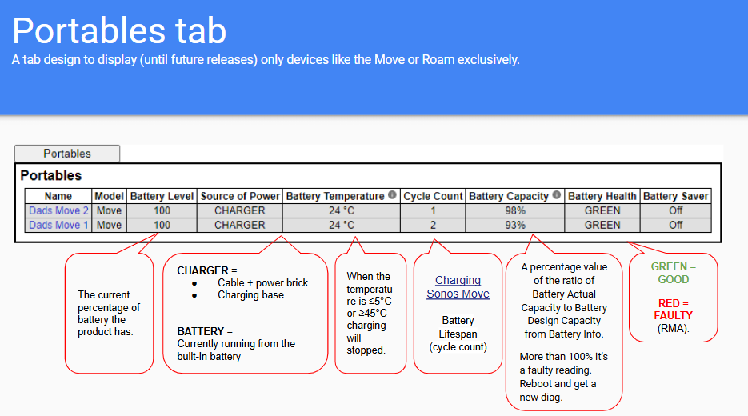

En el component summary se pueden ver, los nombres, ips, coloer, serial number, group, wired, trueplay.

**Uptime** es cuanto tiempo ha estado conectado seguido sin reiniciar

**Reg** esto lo que hace es que el speaker tiene que estar registrado, en algunos casos, dice pending en lugar de secure, ya que no pudo llegar al cloud para completar el registro.

**Notes** es muy importante leer eso, ya que puede decir algo como *no voice services enabled* por lo que no se conectaría a Alexa.

**Root Bridge** ahí se ve si el root bridge que es el que tenga el MAC address mas bajo.

### SNAPPY 

Es como una guía de lo que se puede hacer, incluyendo pasos de troubleshooting, y los Gurus relacionado, da como una lista de pasos a seguir o chequear.

**Voice Summary**

Ahí aparece el device y si tiene activa la opción de music services.

**Portables**

Se puede ver el modelo, source, status of the battery, el battery capcity algo significa que la batería está casi nueva.

#### CUANDO EL PRODUCTO ESTA FUERA DE GARANTIA (1 AñO), NO SE LE REEMPLAZA SE LE DA UN 30% DE DESCUENTO PARA QUE COMPRE UN PRODUCTO NUEVO.

- Hay que chequear **multi SSID** y **audio settings.**
- Fixed volume, es que se le puede poner como un límite al volumen a veces esto le da problema a los clientes
- Volume scalling factor, esto es cuando hay un limite y se puede cambiar.

#### Controller Summary

- ***Associated to*** es el primer device que se conecte a la app.
- Hay que ver en la parte de SSID se puede ver si esta conectado a una red regular o a los datos del celular.
- En **permissions** debe de decir **owner.**
- En el **household ID** se puede copiar y pegar en nirvana para ver los detalles de la red.
- **GC** eso es un group coordinator, el resto son members.
- Puede ser GC **Group Coordinator** y GM (Group member) al lado del GC dice entre parentesis el número de devices conectados.
- El sistema indica entre paréntesis si es **(L) left** o **(R) right.**

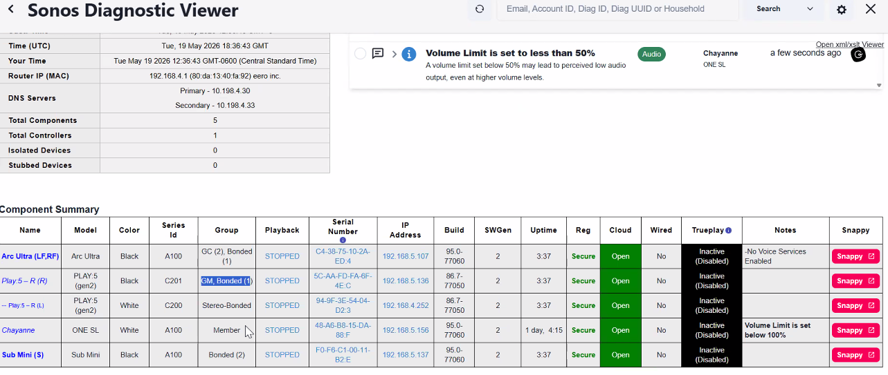

### MODEM Vs ROUTER

#### MODEM
- Convert internet date into a format the router & netwokr computers can transmit & receive.
- Connects your home network to your ISP.
- Holds a public IP address
- Does not create Wi-Fi.
- Modems bridge you to the internet.

#### ROUTER

- Separate external (WAN) and internal (LAN) networks and servers as a gateway for the local network.

#### WAN=MODEM

De 16 para arriba el switch es un managed.

El desktop y el managed, se diferencia ya que el que tiene mas puertos es mas caro.

desktop=unmanaged

Muchas veces hay que decirle al cliente que quite el device del switch al router o modem.

### Data source, data path and player.

### SONOS NET ES UN MESH SYSTEM

### WE DO NOT SUPPORT EXTENDERS

En la parte de diagnóstico, se puede diferenciar, es importante ver el make and model del device para ver que tipo es en Google.

## TOPOLOGY
- Make and model of every hardware device.
- Modem, router, access point, switch extenders.
- How they are connected.

## EXAMPLES
- ZTE ZXHN F689 > TP link DEco E4R ))) Sonos.
- AT&T BGW 320>Sonos

https://support.sonos.com/en-us/article/incompatible-network-hardware

En este link aparecen los routers or modems.

### full name, preferred email for validation.

### MIERCOLES 20 MAYO

Para cambiar el canal en el router on el sonos net. Hay que ver en el Wi-Fi scan para ver cuales son los canales que tienen mas uso, normalmente se usa el **1, 6 y 11**, que son non-overlaping channels.

### *Yes, the TOSLINK cable and the optical cable are exactly the same thing.*

##### SPEECH ENHANCEMENT SE USA PARA QUE EL SISTEMA LE PONGA IMPORTANCIA A LAS VOCES.

##### LOUDNESS ES QUE QUITA CONO LA INTERFERENCIA Y SUENA MAS CLARO.

##### EL CEC TIENE QUE ESTAR ENABLED EN EL TELE SI NO DA PROBLEMAS

### ARC AUTIO RETURN CHANNEL
### CEC ES PARA EL CONTROL

### SONOS LIP SYNC SE MANAGE DESDE EL APP.

### PARA SABER CUAL ES EL PUERTO HDMI QUE FUNCIONA COMO ARC ES CON EL MAKE AND MODEL DEL TELE, HAY QUE GOOGLEARLO Y BUSCAR LA INFO.

El HT topology es hacer algo como:

**HT Topology**

### HOME THEATHER

### INTEFERENCE MARKERS

- Existe una lista de detail component, hay una línea negra que separa los components.
- **PHYER** Se ve la red, por ejemplo 2.4, se revisa si en las dos últimas columnas aparece algún número que no sea cero (0) eso quiere decir que hay interferencia física, que hay algun muro, o algo de metal que haga interferencia, ahí hay que preguntale al cliente.
- **NOISE FLOOR** En esta sección hay tres columnas, la primera se ignora y se toman las columnas 1, 2 y 3.

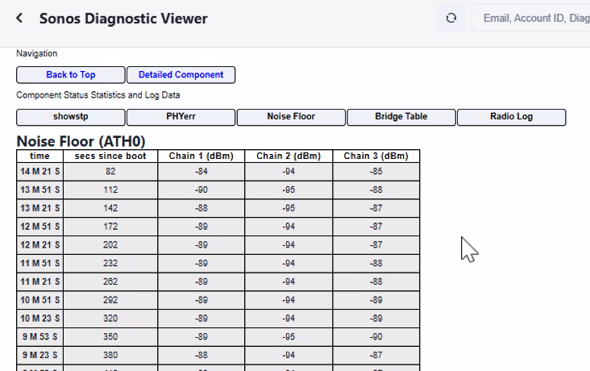

Se puede ver el -85, -88 y asi, eso quiere decir, esos son jumps de 6 por ejemplo, de 84 a 90, cualquier jump de mas de 5 quiere decir que hay interferencia, esto se mide dentro de la misma columna, en alguna de los chains.

**El noise floor** solo se mide en los devices que tengan tres antenas, esto es para confirmar interferencia, esto es para ver si hay jumps de mas de 5. De hecho cada chain es una de las antenas.

**ARP TABLE** es un escaneo de los devices que estan en la red, ahi se puede ver si hay otro router, un extender o cualquier otro device que esté en el local network si hay un device missing saldría. 

Un **ARP (Address Resolution Protocol o Protocolo de Resolución de Direcciones)** es el **protocolo** de red encargado de **vincular** una **dirección IP (lógica)** con una dirección **MAC (física o de hardware)** única de un dispositivo. Es el traductor esencial que permite que los datos lleguen al equipo correcto dentro de una red local (como el Wi-Fi de tu casa).

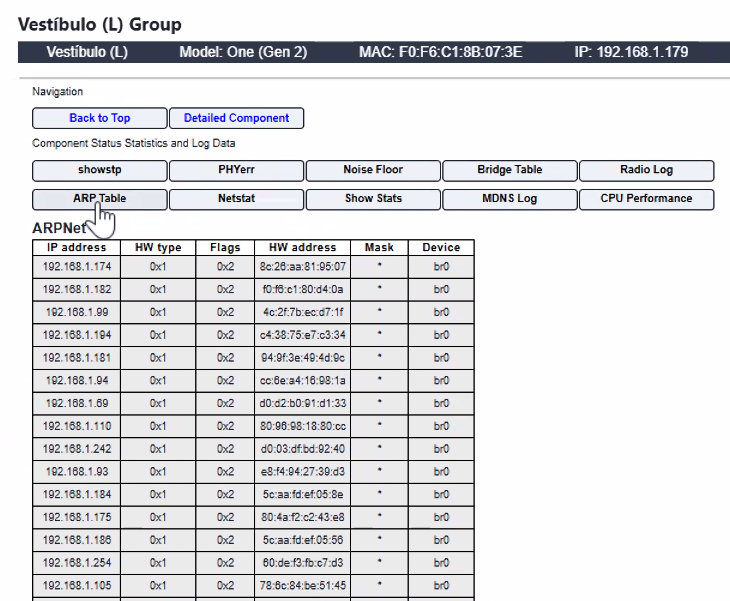

### WI-FI TX STATS

- Es la ruta que toma el device para llegar a por ejemplo sala bar.

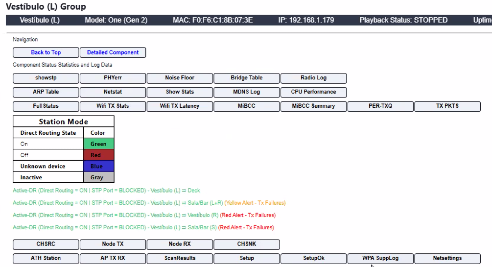

- Aquí se ven los paquetes enviados, si no estan playing, los paquetes que se envían son menos.

Cuando el porcentaje de pérdida de paquetes es mas de 25% es un problema.
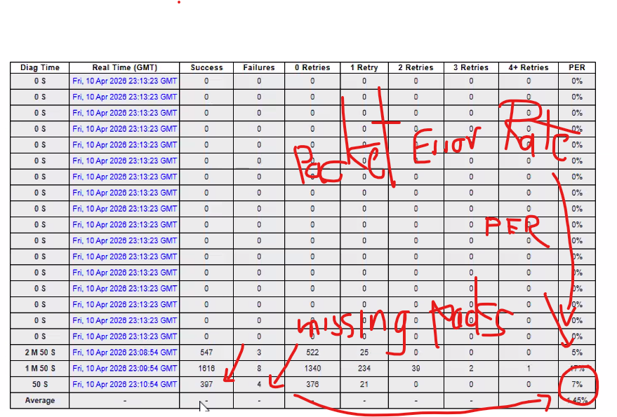

**Lo mas importante es ver el porcentaje de paquetes perdidos o *PER*, debe de ser menor a 25%.

### **MiB CC Summary**

Ahi se ve la interferencia de los productos nuevos.

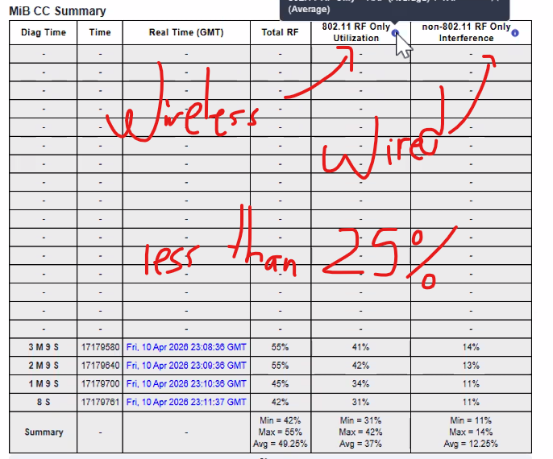

Es para ver si hay interferencia wireless o wire.

#### **PER Tx Queues**

Se puede ver tambien la interferencia

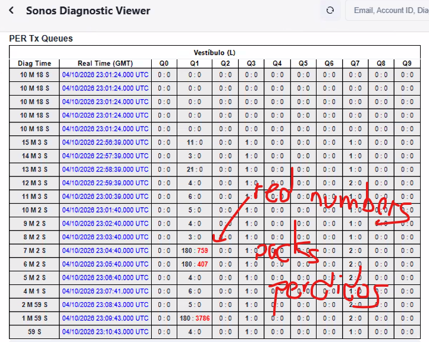

En este grafico se pueden ver los packs perdidos.

### **ATH Station** 

Sirve mucho para dispositivos nuevos.

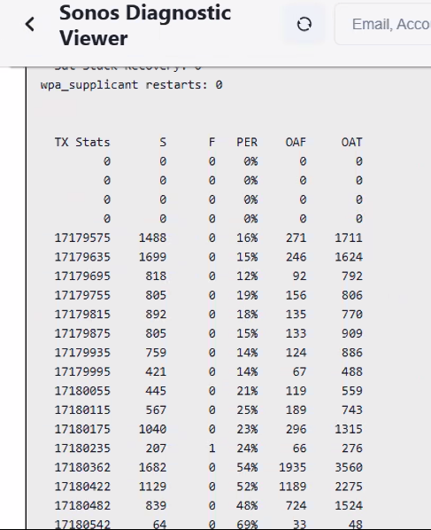

- OAF (Failure)
- OAT (Transmitted)

Aqui se ve la interferencia, es especial para el sonos play.

### **AP TX RX** 

Hay dos logs mas, el primero es player **TX statistics to AP**, y el otro es **Player RX statistics to AP**, uno es donde se envia desde el palyer al AP y el otro es a la inversa.

Tiene que estar por debajo de 25, esta es la imagen de 

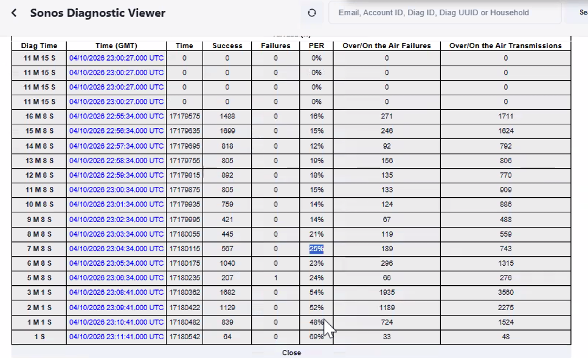

El **beacon** es un pequeño paquete de datos enviado periódicamente por un punto de acceso (Access Point) para anunciar su presencia, o un pequeño emisor Bluetooth usado para geolocalización. En ciberseguridad, el término beaconing describe las señales de actividad emitidas por dispositivos infectados.

Los beacons tiene que estar entre 500 y 600.

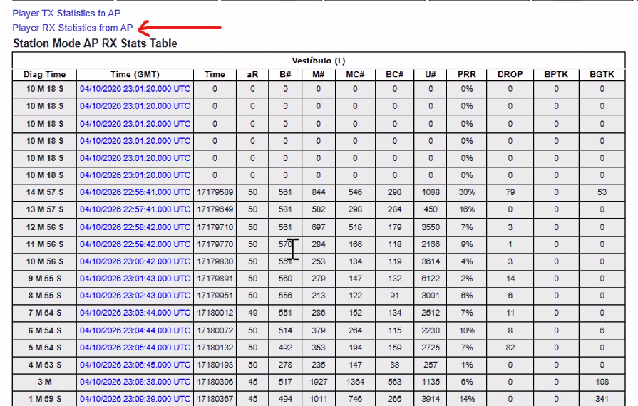

La **M** es de **multicast** en ese ultima sección, en este caso tiene que estar por arriba de 100.

Tiene que tener el multicast activo, si no, no funciona Sonos, algunas veces se tiene que activar.

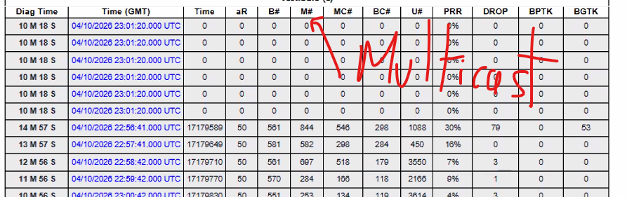

