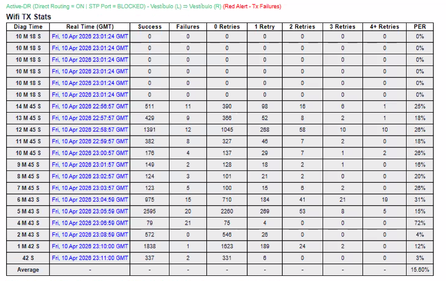
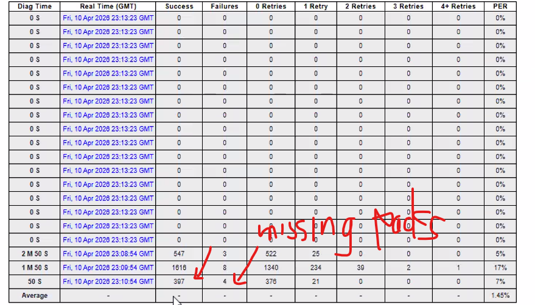
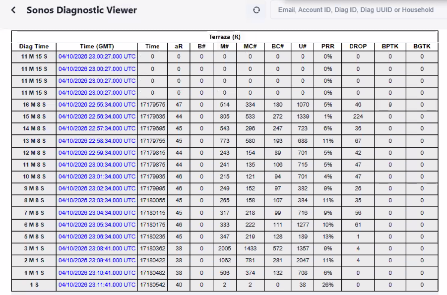

MD > markdown

# Notes Roberto Arias
## titulo 2
### titulo 3

Lista
- Primero
- Segundo
- Tercero

## Network Notes

<!--! rojo -->
<!--* verde -->
<!--? azul -->
<!-- todo amarillo -->

**Bold**

*Italic*

Para poner el color se selecciona la palabra y se le da Control + forward slash, eso pone los parentesis y el formato correcto, y se le pone el simbolo de exclamación, asterisco o simbolo de pregunta y toma color en la parte izquierda que es como la parte de la programación, no sale en el preview, depende mucho del simbolo.

Control + / es para agregar un comentario
|Numerico|

El switch propaga el broadcast, cuando le llega lo va a retransmitir, exceptuando el puerto y fuente de donde viene el mensaje original.

<!--! rojo El router es el que detiene un mensaje cuando se hace un broadcast, ya que el switch lo propaga y flooding a todos, menos a la fuente original del mensaje o paquete de datos. -->

EL **BROADCAST** DOMAIN ES BASICAMENTE LA RED LAN O PRIVADA
EL ROUTER DETIENE EL FLOODING

EL HOME ROUTER NO TIENE ANTENITAS, EL QUE TIENE ES MAS AVANZADO. 

Para que los speakers de SONOS funcionen en conjunto deben de estar dentro del mismo **BROADCAST DOMAIN**

Los speakers no se conectan con otro tipo de red que no sea regular wi-fi nada de internet celular o satelita.

CMD Command **TraceRT**
Ese comando es para ver cuantos servidores o broadcast domains

Which standard contains the specifications for Wi-Fi 802.11
A. IEEE 802.11
B. IEEE 802.3
C. LTE
D. GSM
E EIA/TIA 268A

La respuesta correcta es la primera, la clave es que diga 802.11, que es lo relacionado al WiFi settings.

*************************************************************

**DHCP**

DHCP discovery, es que el server envía un **flooding**, a todos para ver si hay un DHCP server.

Luego viene el **offer** de un IP address desde el DHCP server.
Lueo viene el **request** y finalmente se le da y se hace un **acknowledgement**.

Son cuatro pasos

- DHCP Discovery (La PC envía un flooding)
- DHCP Offer (Esto lo envía el DHCP server) 
- DHCP Request (La PC confirma que si y hace el request)
- DHCP Acknowledge (El DHCP server hace ack del ip que le dio a la compu)

Es como decir **DORA** la exploradora.

## **Un mensaje con las puras FFFF es un Broadcast**

El DHCP reservation puede dar problemas con Sonos, no debe de haber nada reservado.

## **EL DHCP NO SE PUEDE CONFIGURAR EN UN SWITCH, SOLO EN UN ROUTER.**

Los dispositivos de Sonos solo soportan la conexión Wi-Fi, y algunos pocos también el bluetooth, las otras deben de ir siempre en Wi-Fi

**Antenas de routers**

Omnidirectional Antenna, es la que envia a 360 grados.

Directional Antenna, este tipo de antena directional no es soportado por Sonos, debe de ser apagado en los settings del modem.

## **WIRELESS ACCESS POINT (WAP O WIRELESS ACCESS POINT)**

**Autonomous Access Point** (Funciona de manera autónoma no depende del wireless controller como el otro)

**Controller-Based AP (Lighweight AP)** este depende de otra persona, depende del wireless controller, si hay broncas se configura el wireless controller.

**Wireless Extender EXT**, no se soporta, este repite or boosts wifi signal areas with poor conexion.

**AD HOC MODE**, este es el device to device, es como un **peer to peer.**

**Tethering / Hostpot**, estos no se soportan.

**Infraestructure home of office wi-fi** Para el initial setup solo se usa el regular home Wi-Fi.

**Basic Service Set BSS** Es como la topología.

**Extended Service Set (ESS)** multiple access points, create one large Wi-Fi network. ESS se usa en buildings and campuses to provide one unified Wi-Fi network, normalmente se usa un wireless controller.

## **Standards**

There are two main options to chose from 2.4 Ghz and 5 Ghz, el mas largo tiene mas alcance pero menos señal o una señal débil, para que los dispositivos de sonos deben de estar las dos opciones, 2.4 Ghz y 5 Ghz. Si solo tiene la de 5 no sirve.

Si dos routers cercanos chocan las ondas, better distance but slower speeds.

Hay que usar non-overlapping channels, que son el **1,6 o 11** para reducir la interferencia entre modems.

Para el 5 GHz los commom non-overlapping channels include **36, 40, 44, and 48.**

**Standards**

Wi‑Fi standards determine the frequency, speed, and coverage of a wireless network.  
There are two main options to choose from: **2.4 GHz and 5GHz.**

⚠️ ALERT:  For most Sonos devices to work, the router must support both **2.4 GHz and 5 GHz.  Routers with only 5 GHz are not supported.**

## **Important settings to check for 2.4 GHz and 5 GHz**

- If both bands (5GHz and 2.4GHz) share the same Wi‑Fi name (SSID), rename them and separate the bands. Disable Band Steering and Smart Steering if available.

- Make sure the wireless mode is set to b/g/n (supports multiple Wi‑Fi standards).

- Set the channel width to 20 MHz.

- Not all Sonos devices support Wi‑Fi 5 (802.11ac), esta Wi-Fi 5 es la opción mas nueva, y algunos dispositivos viejos no lo soportan.

**Rangos válidos de IP privadas:**
10.0.0.0 – 10.255.255.255
172.16.0.0 – 172.31.255.255
192.168.0.0 – 192.168.255.255

**Rangos válidos de IP públicas:**
1.0.0.0 – 9.255.255.255
11.0.0.0 – 126.255.255.255
128.0.0.0 – 191.255.255.255
192.0.0.0 – 223.255.255.255

## TCP

retransmite
Reliable

- Connection‑oriented
- Reliable (guarantees delivery)
- Data arrives in order
- Slower (more overhead)
- Error checking: Yes
- Accuracy matters more than speed
- Web browsing, file transfer, email

## UDP 
no retransmite
videollamadas, telefonía
unreliable, no garantiza que se entregó

- Connectionless
- Unreliable (no delivery guarantee)
- Data may arrive out of order
- Faster (less overhead)
- Error checking: Minimal
- Speed matters more than accuracy
- Streaming, voice, discovery services

## DOS

 Overwhelms the WLAN with traffic, preventing legitimate users from accessing the network.

Es un denial of services, es cuando por ejemplo se hace un pedido masivo de uber y uber al final no puede dar el servicio.

## ROGUE ACCESS POINT

Unauthorized AP
An unauthorized or fake access point that mimics a legitimate one, tricking users into connecting and exposing their data.

## MAN IN THE MIDDLE ATTACK (MITM)

 An attacker intercepts communication between a user and the network, allowing data to be monitored or altered without detection.

 

## HIDDEN SSID / NETWORK CLOAKING

This a Wi‑Fi feature that controls whether the network name (SSID) is visible. Sonos doesn't support hidden SSID

## MAC Address Filtering

MAC Address Filtering is a security feature that allows or blocks devices from connecting to a network based on their unique MAC address. If “block any” is enabled, it can prevent devices like Sonos from connecting.

## VPN

A VPN (Virtual Private Network) creates a secure tunnel over a public network, such as the internet. For SONOS proper operation, the VPN should be turned off.

## Guest Network

A guest network is a separate Wi‑Fi network created for visitors, isolated from the main network. Sonos does not work on guest networks.

### SONOS NO SIRVE CON VPN Y GUEST NETWORK

----------------------------------------------------------------------------

## OTHER UNSUPPORTED SETUPS

**Universal Plug n Play disabled** (Es un riesgo de seguridad enorme), pero para SONOS UPnP debe de estar habilitado, para que sirva en wi-fi o cable.

**QoS Quality or service enabled**

Esto es que le da prioridad a cierto tráfico, prioritize traffic but often does a bad job with real-time audio. For Sonos should be off or it may cause audio delays and cutouts.

**IGMP** 

Internet Group Management Protocol, group es el grupo de speakers o algo similar, 

Sonos relies heavily on multicast traffic.

**IGMP Proxy: OFF** → prevents multicast from being misrouted  

**IGMP Snooping: ON** → keeps multicast traffic controlled inside the network 

Es relacionado al multicast, si no sirve o esta activo, SONOS no funciona correctamente.

**Smart Connect TAMBIEN CONOCIDO COMO STEERING** 

Esto hay que apagarlo para que Sonos no de problema.

*Smart Connect automatically moves devices between 2.4 GHz and 5 GHz.  
Sonos hates this. It causes random disconnects.
Turn it OFF.*

Lo que hace es que el router decide donde conectarse y lo cambia de red entre una y otra.

**AIRTIME FAIRNESS**

Es que si usted se conecta primero tiene prioridad en la red, esto se debe de deshabilitar para Sonos.

Airtime Fairness limits older or slower devices.  

Sonos behaves like a legacy device and needs constant data flow.  

With Airtime Fairness ON,
Sonos gets throttled → audio drops.  

Disable it.

## Incompatible network hardware

## **TROUBLESHOOTING STEPS**

- 1. Confirm the Problem (Is it real?)
- 2. Identify What’s Involved (What are we working with?)
- 3. Check the Obvious Stuff First (Simple Wins)
- 4. Look for Basic Hardware or Setup issues.
- 5. Wireless Specific Problems
- 6. Internet & Network Services (More Complex)
- 7. Track What You Did (Don’t Guess Twice)

**Quick methods that save time:**

Substitution → swap cable or device
Comparison → does another device work in the same spot?

Ctrl+D en VSCode selecciona en bloque.

## Unsupported network setups and devices
- Wireless internet connections such as satellite, mobile hotspots, or LTE routers
- Guest networks or networks that use a portal login page
- Networks using wireless range extenders2
- Routers that only provide 5 GHz WiFi
- Ethernet over Power (EOP) devices
- WPA/WPA2 Enterprise
- VPNs blocking access to local network resources.

**PORT NUMBER FOR REMOTE DESKTOP CONNECTION 3389** 

**Se puede conectar el RDP al puerto del web server el cual es el 443**

**SOURCES OF KNOWLEDGE**

Hay una inteligencia artificial que responde preguntas de Sonos, en relación a la inteligencia artificial algunas veces se pone a batear.

Hay que modificarle los settings, tienen varios features, 

## **INTELIGENCIA ARTIFICIAL**

- **Agreeability** (3/10): es que tanto va a estar de acuerdo con usted, nunca llevarle la contraria, 3 de 10 es que no esté tan de acuerdo conmigo, es configurarla para que no nos diga lo que queremos oir.

- **Critical** (8/10) que tan críico es con el trabajo que le esta haciendo a usted, que me oontraargumente, no que me diga lo que quiero escuchar.

- **Formal** (3/10) que tan formal o informal quiero que me responda.

- **Politeness** (0/10) remove everything you can, be mean if it applies.

- **SafetY** (0/10) los trucos que no se pueden hacer, que me los diga.

## *Bottom line:  Sonos works best on a simple, stable network. Fancy router “optimizations” usually make things worse.*

## SONOS Segunda Semana de Training

todos los dispositivos de Sonos tienen un alcance de:

**25 Feet** (7 m to **connect**)
**10 Feet** (3 m to **pair**)
**50 feet** (15 m to **play**)

Todos los dispositivos de sonos estan certificados como **IP67** el 6 quiere decir que es un dispositivo sellado que no admite polvo y que es resistente al agua, el 6 quiere decir que esta sellado y no le va a entrar polvo y el 7 es que tiene alrededor de un metro de waterproof.

Todos los dispositivos de SONOS tienen los siguientes accesorios:

- Power adapter
- Charging Base
- Replacement Battery Kit
- Line-In and Combo Adapters
- Wall Hook
- Belkin Carry Case

## Sounds better together
Sonos Play can group on the go with another Sonos Play or Move 2 whilst connected to the speaker via Bluetooth*. This works with a total combination of up to **four** speakers.

## Tunes itself like magic

Automatic Trueplay™ makes sure you get the best possible sound, no matter where your speaker is* by using a built in accelerometer to identify movement and simultaneously make EQ adjustments.

## **Stream**

All your favorite music, audiobooks, podcasts, and stations straight from the Sonos app, which supports over 100 music services worldwide.

**How to Add a Service**
First, make sure you have an account with the service provider, such as Spotify or Apple Music. Then in the Sonos app go to **Settings > Services & Voice > Music & Content > Add a Service**. Select an available service and follow the instructions to sign in.

**Adding Multiple Accounts of a Single Service**
If you live with others who have different taste and their own account with the same service, you can both enjoy listening on Sonos. You'll see the name associated with each account below the service's description in the Sonos app, so you know which one is yours.

Basicamente se agrega en la aplicación y luego se selecciona el usuario en la parte superior izquierda.

## NFC
Esto quiere decir Near Field Communication, it acts a shortcut for Bluetooth, 

**Pin**
Products like Amp and Port do not have speakers that emit sound. During setup, the app will ask you to enter the PIN on the product. Once you have entered the PIN, the app will ask you to press the Join button on the product.

**Join Button**
You can also connect your product to the app by pressing the Join button when instructed.

El metodo para que se pueda agregar es mediante el PIN, eso dice la página web.

## True Play

What is Trueplay?

Purer sound through smarter speakers.

Place your speaker wherever you like with Trueplay tuning. Our all-in-one speakers and home theater systems can adapt to any room for the truest sound.

### *True play only works in iOS*

The shape of a room, the furniture within it and where you place your speaker can all distort the true sound of the music. Trueplay tuning ensures sound is right for the room and true to the music, no matter where the speaker is placed.

** WITHOUT TRUEPLAY EVERY ROOM SOUNDS DIFFERENT **

Este sistema utiliza el micrófono de un dispositivo iOS como un iPod o iPad para ver como está el sonido de algun room, para acceder a esa opción hay que ingresar a la aplicación y luego ir donde dice **Room Settings**.

Trueplay tuning in action.

  

